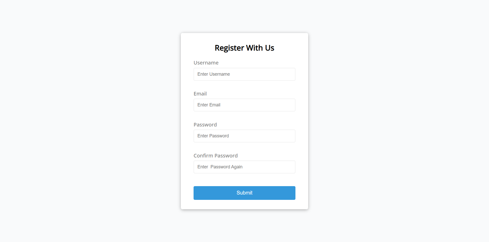

# Form Validator 

`Author:` Padmanabh Belavadi

This is the project based on the idea of `Validating A Form`.
in this there will be a 4 input fields all are mandatory and also `Javascript` is used for validating password strength and conveting it into hash code.

## My Project Looks Like :

## Reach Me Out on

 [Linkedin](https://www.linkedin.com/in/padmanabh-belavadi)

 [GitHub](https://github.com/padmanabh-b)

 [Instagram](https://www.instagram.com/legend_padmanabh/)

 [Findcoder](https://www.findcoder.io/u/padmanabh_b)

